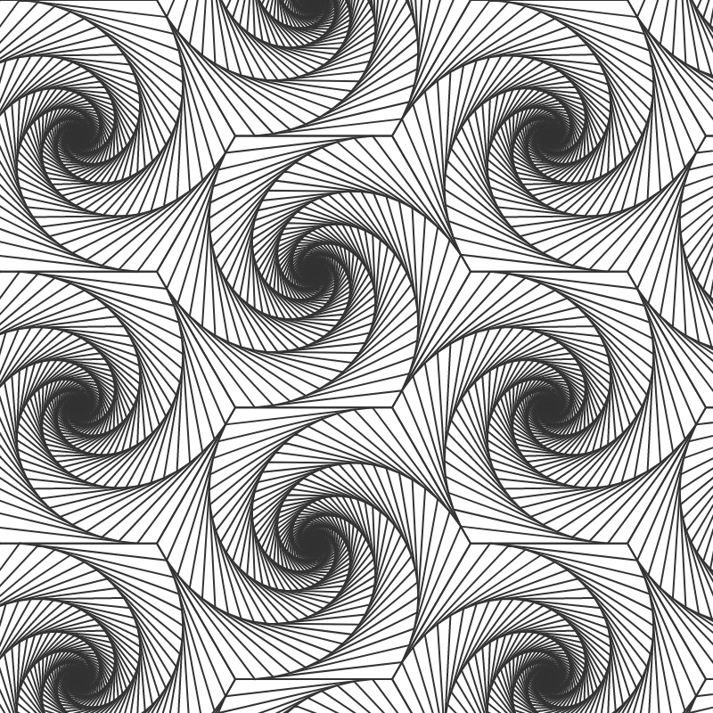
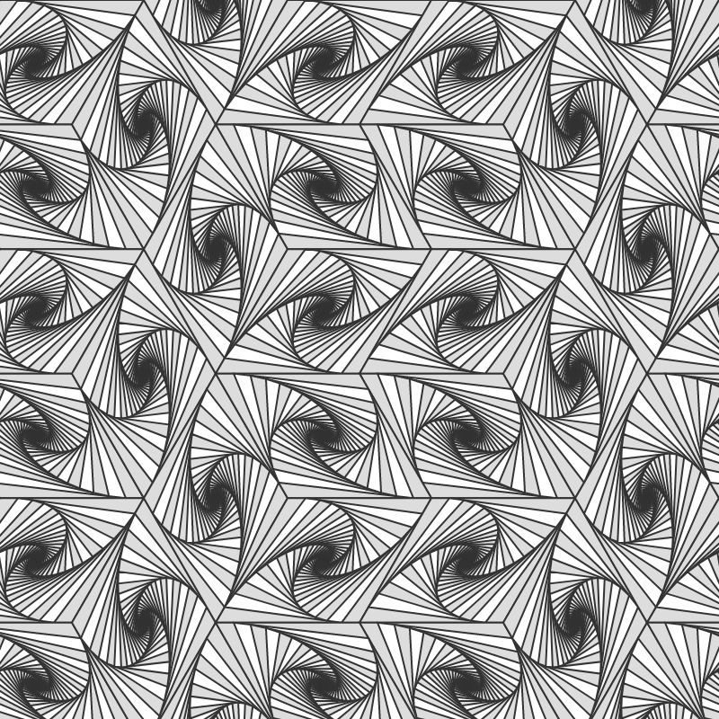
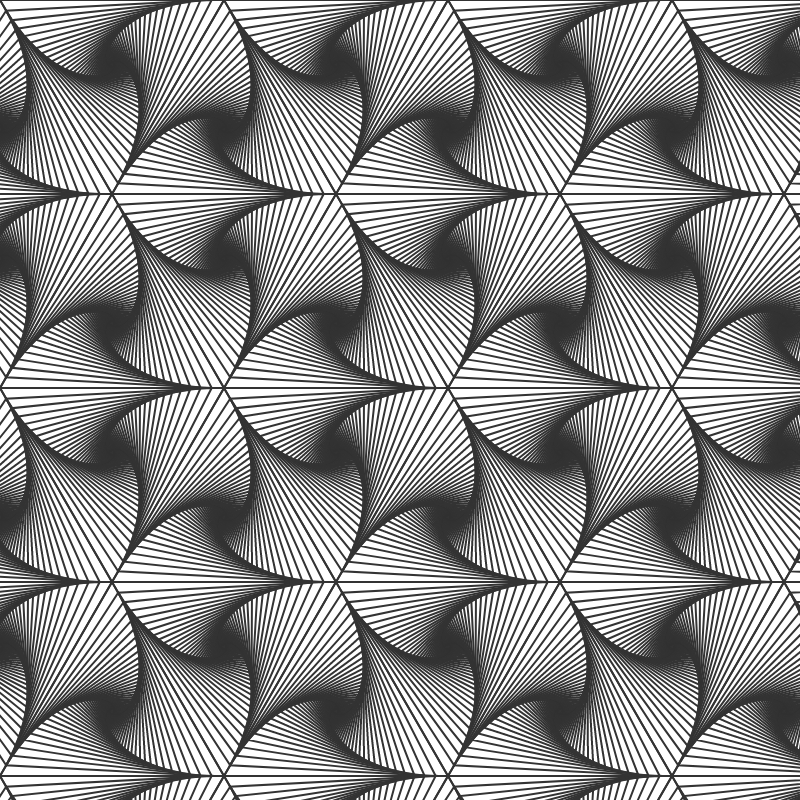
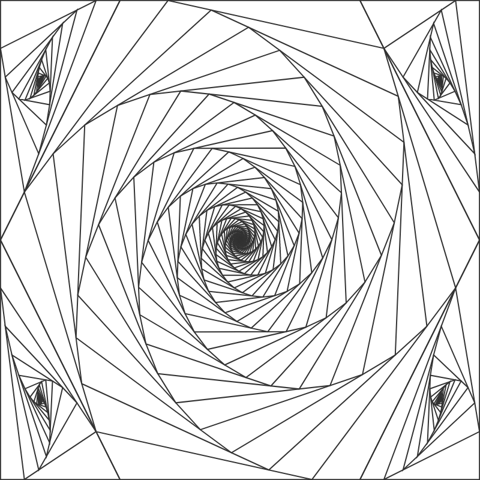

# polygon-spirals

A tool to draw cool pictures with polygons forming spirals

Created by L. Chasserat & T. Petitfils.

## Notes

For now the web CLI only supports exports to PNG. It is required to use the Python code to get SVG format.
A "Download information" option is available in the GUI. It can be used to extract the image settings than can then be fed to the Python script in order to obtain a SVG copy.

